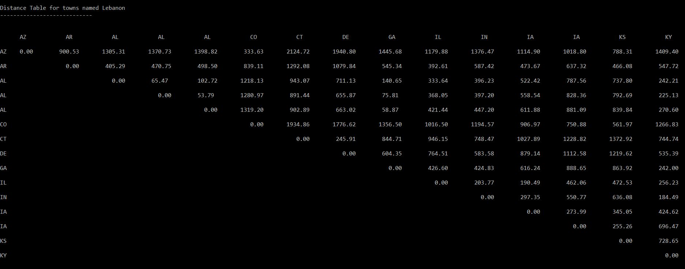

# Distance Analysis

This project determines the distances from each town named "Lebanon" in a set of states to all of the other towns named "Lebanon" in that same set of states.

#### Objectives
1. Preprocess data from shapefiles in order to create a table with around 15 towns named "Lebanon".
2. Export table with necessary fields to CSV file.
3. Create python script that reads in CSV file and calculates distances from each town to all of the others.
    * Write out to a triangle formatted table.

#### Output Table

